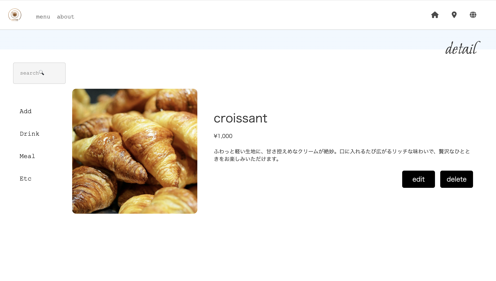

# README


test: minitest

[開発記録>](./.md/./DEV.md)

[ページのスクリーンショット>](./.md/assets/)

## home


## Product



## Model

### Product

| フィールド    | バリデーション                                                                                                                                                                                                    |
| ------------- | ----------------------------------------------------------------------------------------------------------------------------------------------------------------------------------------------------------------- |
| `uid`         | **一意** **自動生成**                                                                                                                                                                                             |
| `name`        | **必須**<br> **文字数制限**: `name`は3文字以上、50文字以下でなければなりません。                                                                                                                                  |
| `cost`        | **必須**<br> **数値制限**: `cost`は0より大きい数値でなければなりません。                                                                                                                                          |
| `price`       | **必須**<br> **数値制限**: `price`は0より大きい数値でなければなりません。                                                                                                                                         |
| `category`    | **必須**                                                                                                                                                                                                          |
| `description` | **必須**<br> **文字数制限**: `description`は200文字以下でなければなりません。                                                                                                                                     |
| `ref`         | **Optional** <br> **コンテンツタイプ**: 画像は `image/png`, `image/jpg`, `image/jpeg`, `image/gif`, `image/webp` のいずれかである必要があります。<br> **サイズ制限**: 画像のサイズは5MB未満である必要があります。 |

### Event

| フィールド   | バリデーション                                                                 |
| ------------ | ------------------------------------------------------------------------------ |
| `date`       | **必須**                                                                       |
| `content`    | **必須**<br> **文字数制限**: `content` は140文字以下でなければなりません。     |
| `content_en` | **Optional**<br> **文字数制限**: `content` は140文字以下でなければなりません。 |

## セットアップ方法

### 依存関係のインストール

```bash
rails -v
# Rails 7.0.4.3
bundle -v
# Bundler version 2.6.3

bundle install
```

### APIキーのセット

設定しなくても動きます。

`.env_sample`にKEYをセットし`.env`に名前を変更します。

### データベースのセットアップ

```bash
rails db:create
rails db:migrate
rails db:seed
```

### アプリケーションの起動

```bash
rails server
```

### ロケール設定

日本語にも少しだけ対応しています。

```ruby
# config/application.rb
config.i18n.default_locale = :ja #:en
```

### テストの実行

```bash
rails test
```

### Lint

```bash
rubocop
```

### debug情報を表示する

```rb
# config/environments/development.rb
config.consider_all_requests_local = true
```
